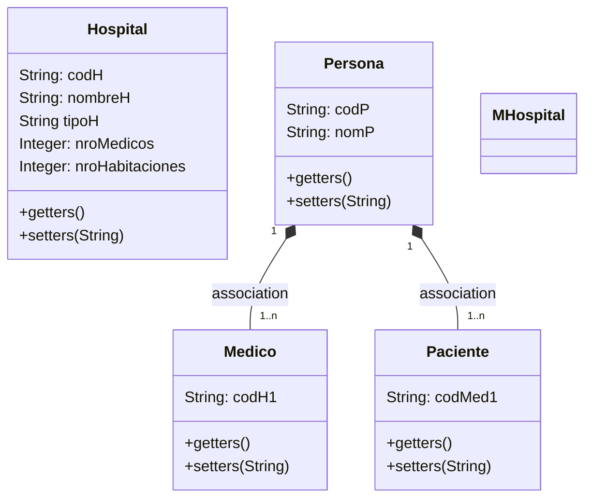

# PROYECTO 'MI SERGAS' :briefcase:

## Descripción:

El presente proyecto tiene como finalidad gestionar los datos de hospitales, médicos y pacientes en la base de datos del SERGAS.

Esto haciendo uso del patrón **MVC**, y el servicio **MySQL**. Más adelante se explica la estructura de la aplicación.

---
## Diagrama de Clases:

