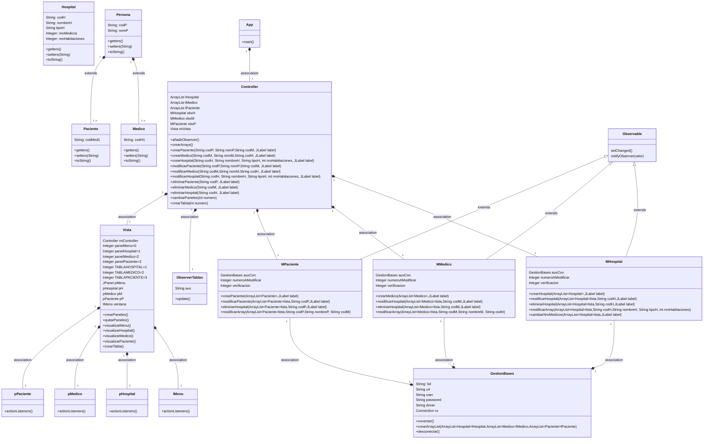

# PROYECTO 'MI SERGAS' :briefcase:

## Descripción:

El presente proyecto tiene como finalidad gestionar los datos de hospitales, médicos y pacientes en la base de datos del SERGAS.

Esto haciendo uso del patrón **MVC**, y el servicio **MySQL**.

Si nos referimos a las principales funciones del programa, podemos decir que son: agregar, modificar y eliminar pacientes/medicos/hospitales (considerando las características principales que puede llevar respectivo rol), además de poder cuantificar el número de médicos que hay según el hospital consultado.
Todo esto, respetando una clave única y primaria para cada uno de los tipos de datos a manejar.

A continuación, se esquematiza la estructura de la aplicación.

---
## Diagrama de Clases:

## Diagrama de Secuencias:

